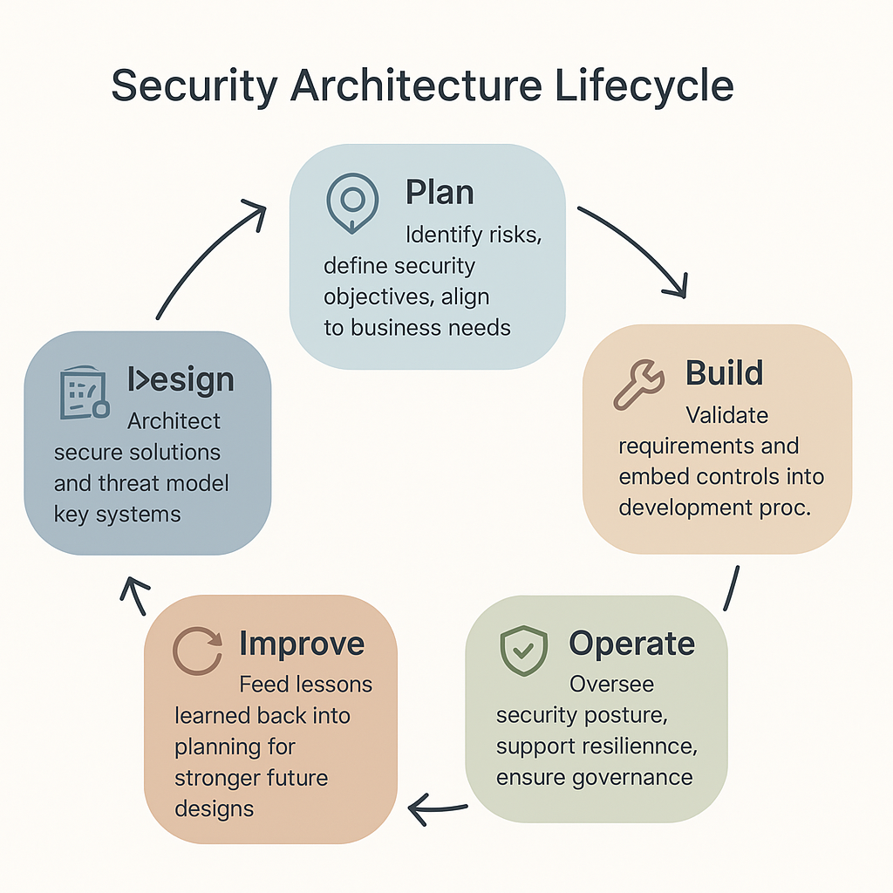

# Security Architecture Lifecycle

This lifecycle model provides a high-level view of where Security Architecture fits into the broader context of system development and operations.

It helps clarify *when* to engage as a security architect, *what* to focus on at each phase, and *how* your architectural thinking ensures the continuity and resilience of secure systems.

---

---

### Phase Descriptions

- **Plan**  
  Identify risks, define security objectives, align to business needs.

- **Design**  
  Architect secure solutions and threat model key systems.

- **Build**  
  Validate requirements and embed controls into development processes.

- **Operate**  
  Oversee security posture, support resilience, ensure governance.

- **Improve**  
  Feed lessons learned back into planning for stronger future designs.

---

### Related Resources:
- [Becoming a Security Architect: The Blueprint](../00_blueprint/becoming_a_security_architect.md)
- [Skill Progression Map](../assets/visuals/skill_progression_map.png)

This lifecycle pairs closely with the [Skill Progression Map](../00_blueprint/skill_progression_map.md) to show how strategic thinking and architectural engagement evolve over time.

Both models reinforce that Security Architecture is not just a role, it's a rhythm, a continuous practice of aligning, designing, adapting, and improving.
