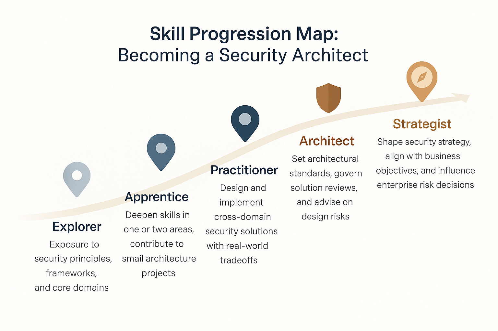

# Skill Progression Map: Becoming a Security Architect

This map provides a visual overview of the stages involved in growing into a Security Architect.

The journey is not linear for everyone, but understanding the typical progression can help you plan your learning and career development more intentionally.

---

---

### Related Resources:
- [Becoming a Security Architect: The Blueprint](becoming_a_security_architect.md)

Explore the [Blueprint guide](becoming_a_security_architect.md) for a detailed explanation of each stage, along with mindset shifts and skill-building strategies to support your growth.

---
© 2025 Elemental Security Solutions, LLC
Part of the Security Architecture Knowledge Base.
Licensed under the MIT License.
