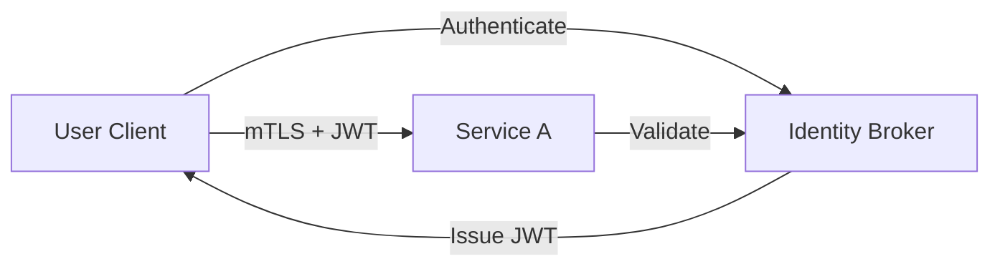

# Identity Broker Pattern

**Summary**  
Centralize authentication and authorization through a trusted identity broker service, issuing time-bound tokens and enforcing policy consistently.

## Problem and Context
- Managing identity within each service leads to duplication and inconsistent policy.
- Multiple identity providers increase complexity and attack surface.
- Services need uniform token formats and trust boundaries.

## Threat Considerations
- Token interception or replay can lead to user impersonation.
- Identity spoofing if tokens are forged or tampered.
- Misconfiguration can allow services to skip validation.

## Solution Description
1. All client requests pass through the Identity Broker over a secure channel.
2. Broker authenticates via OIDC/OAuth2 and issues signed JWTs with claims.
3. Broker enforces RBAC or ABAC policies and embeds decisions in tokens.
4. Services validate signature and claims against the broker's JWKS endpoint.
5. Use short-lived access tokens plus refresh tokens guarded by additional checks.

## Diagram

## Implementation Notes
- Use standard OIDC client libraries and JWT validators.
- Provide a JWKS endpoint for public key distribution.
- Log token issuance and validation events for audit.

## Real-World Example
- A misconfiguration in Service X allowed acceptance of unsigned tokens, leading to unauthorized data access in 2021.

## References
- RFC 7519: JSON Web Token
- OpenID Connect Core 1.0
- OAuth 2.0 Authorization Framework
