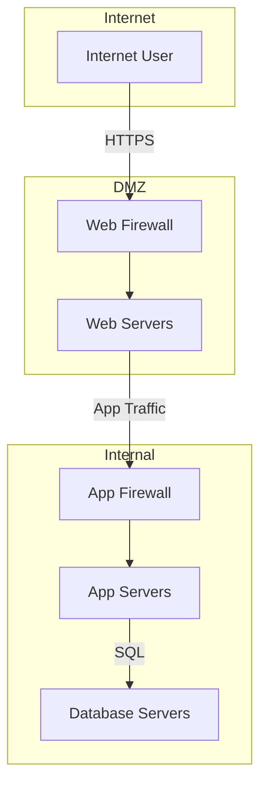

# Network Segmentation Pattern

**Summary**  
Divide a network into zones with strict controls at each boundary to limit lateral movement and contain breaches.

## Problem and Context
- Flat networks allow attackers to traverse freely once inside the perimeter.
- Diverse workloads require different security postures.
- Regulatory compliance often mandates segmentation between environments.

## Threat Considerations
- Lateral movement by compromised hosts.
- Rogue devices connecting to unauthorized segments.
- Misapplied rules that create gaps.

## Solution Description
1. Define security zones based on trust level and function.
2. Enforce traffic rules at zone boundaries via firewalls or service mesh.
3. Apply least-privilege: only required ports and protocols are allowed.
4. Monitor and log all inter-zone traffic for anomalies.

## Diagram

## Implementation Notes
- Use network ACLs or cloud network policies for enforcement.
- Regularly review and audit segmentation rules.
- Automate baseline rule deployment via IaC.

## Real-World Example
- A breach at Company Y was contained within the DMZ due to proper segmentation, preventing access to the database environment.

## References
- NIST SP 800-125A: Secure Cloud Deployment
- CIS Controls V8: Network Security Management
