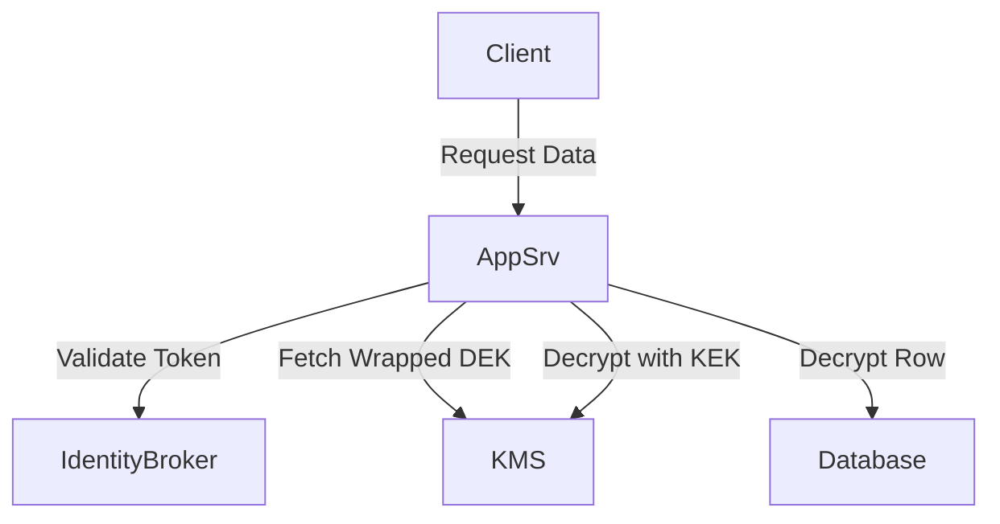

# Token-Based Row-Level Encryption Pattern

**Summary**  
Encrypt data at the row level using tokens or keys tied to user or tenant identity, limiting exposure if a breach occurs.

## Problem and Context
- Bulk encryption of data stores can expose all records if a single key is compromised.
- Multi-tenant databases require tenant isolation.
- Regulatory requirements may demand data segregation.

## Threat Considerations
- Key compromise leading to mass decryption.
- Tenant data exfiltration by a privileged user.
- Key management complexity.

## Solution Description
1. Generate a unique data encryption key (DEK) per row or tenant.
2. Store DEKs protected by a key encryption key (KEK) in KMS.
3. Issue access tokens that include decryption rights for specific rows.
4. Services fetch and unwrap DEKs only when authorized.

## Diagram

## Implementation Notes
- Use envelope encryption via cloud KMS.
- Integrate token claims with DEK access policies.
- Audit all key unwrap and data access events.

## Real-World Example
- A SaaS provider implemented this in 2022 to isolate tenant data within a shared Postgres cluster.

## References
- AWS KMS Developer Guide
- Google Cloud KMS Documentation
